<div align="center">
  
</div>

<br/>

<div align="center">

<a href="https://archive.phantom-illusions-studio.com/about"></a>
<a href="https://github.com/mrblaqbeatle"></a>
<a href="mailto:REPLACE_WITH_YOUR_EMAIL"></a>

</div>

<br/>

```yaml
$ whoami
name: Mwanani Ezra
alias: Mr. Blaq Beatle
based_in: Uganda
role: Software Developer, Co-Founder @ Phantom Illusions Studio
focus:
  - Backend Systems
  - Android Development
  - Web Applications
  - Distributed Systems
  - Real-time Networking
  - UI / UX Design
languages:
  - TypeScript
  - Python
  - Kotlin
  - JavaScript
  - SQL
  - GDScript
  - C++
```

I build complete systems end to end — logic, backend, database, and deployment. Most of my work centers on **backend architecture** and **transaction-safe systems**, extending into **Android development** and, when the project calls for it, **real-time multiplayer engineering**. I also design and produce my own visual assets — branding, UI mockups, promotional art — rather than outsourcing them.


## Phantom Illusions Studio

I'm a **co-founder and software developer** at **Phantom Illusions Studio**, an independent software studio building software products out of Uganda.

**My role:** architecture, backend engineering, and systems development across the studio's products, plus the visual identity work — branding, UI, promotional design — that goes with shipping something.

**Studio Portfolio:** https://archive.phantom-illusions-studio.com/about


## Featured Work

```
$ ls projects/
phantom-lock/       caj-detergents/      aroma-restaurant/      illusion-cli/
```

### `phantom-lock/` — in active development
Android security application for remote device management via SMS commands, built for scenarios where a device needs to be secured or located without an internet connection.

```
STACK     Kotlin, Jetpack Compose
TARGET    SDK 36 (min SDK 30)
STATUS    Active development
```

Android's background execution limits are aggressive, so staying persistent and responsive to SMS commands required a layered defense:

- Fixing `ForegroundServiceStartNotAllowedException` restart paths
- A transparent system overlay anchor to influence OOM priority
- An `AlarmManager`-based watchdog, replacing WorkManager where it wasn't reliable enough
- A deduplicating dynamic `BroadcastReceiver`
- OEM-specific battery optimization handling (MIUI, EMUI, One UI, and others)

---

### `caj-detergents/` — production e-commerce
Production e-commerce site for a local Ugandan business — product showcase, responsive layout, business information pages.
**Live:** https://mrblaqbeatle.github.io/CAJ/

### `aroma-restaurant/` — digital menu experience
Restaurant site focused on digital menu presentation and customer experience.
**Live:** https://mrblaqbeatle.github.io/aroma/index.html

### `illusion-cli/` — experimental
Command-line environment exploring terminal-based workflows and developer tooling.


## Engineering Interests

- Backend architecture
- Transaction-safe systems
- Android systems programming
- Distributed applications
- PostgreSQL and data modeling
- DevOps and deployment


## Stack

```
$ stack --list
```

**backend**
<p>        </p>

**android**
<p>    </p>

**web &amp; languages**
<p>       </p>

**game development**
<p>  </p>

**design**
<p>    </p>

**infrastructure &amp; tools**
<p>       </p>


## Design + Code

Most of my projects carry visual work I've done myself — UI mockups, branding, and promotional art built in Photoshop, Inkscape, and GIMP — rather than stock assets. I treat design as part of the engineering process, not a separate step handed off to someone else.


## Stats

<p align="center">


</p>

<p align="center">

</p>


```
$ status --current
[ACTIVE]   phantom-lock          Android device recovery application
[ACTIVE]   phantom-illusions     Building software products with co-founders
```

<div align="center">
<br/>
<sub>KAMPALA, UG · <a href="https://archive.phantom-illusions-studio.com/about">PORTFOLIO</a> · <a href="https://github.com/mrblaqbeatle">GITHUB</a></sub>
<br/><br/>

</div>
